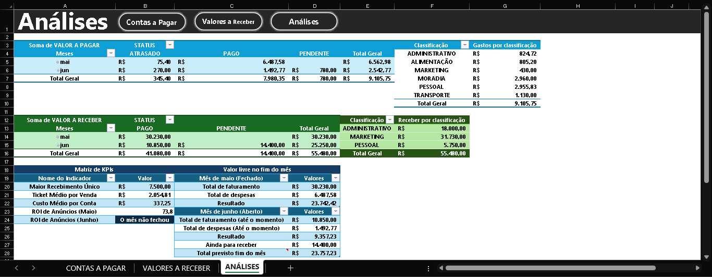

# 📊 Sistema de Inteligência Financeira

> Uma solução estruturada para gestão de fluxo de caixa, análise de rentabilidade e controle de despesas.

---

## 📑 Sumário
- [Objetivo](#-objetivo)
- [Funcionalidades Principais](#-funcionalidades-principais)
- [Tecnologias Utilizadas](#-tecnologias-utilizadas)
- [Visualização do Sistema](#-visualização-do-sistema)
- [Guia de Utilização](#-guia-de-utilização)

---

## 🎯 Objetivo
Este projeto foi idealizado para suprir a necessidade de uma gestão financeira clara, transformando registros brutos de entradas e saídas em indicadores de performance (KPIs) essenciais para a tomada de decisão.

## 🛠 Funcionalidades Principais

| Recurso | Descrição |
| :--- | :--- |
| **Controle de Pagamentos** | Registro detalhado de contas com classificação de status e centro de custo. |
| **Gestão de Recebíveis** | Monitoramento de entradas, permitindo prever o fluxo de caixa futuro. |
| **Matriz de KPIs** | Cálculo automático de ROI, Ticket Médio e Resultado mensal. |
| **Navegação Inteligente** | Interface com botões para transição rápida entre abas. |

## ⚙️ Tecnologias Utilizadas
*   **Excel Avançado:** Estrutura base para processamento e modelagem.
*   **Fórmulas Lógicas:** Uso intensivo de `SE` para classificação de status e cálculos condicionais.
*   **Tabelas Dinâmicas:** Consolidação de dados para geração de relatórios de análise.
*   **Segmentação de Dados:** Filtros interativos para visualização personalizada.

## 📈 Visualização do Sistema

---

## 💡 Por que esta estrutura funciona?
A separação técnica entre **bases de dados (fatos)** e **painéis de visão (análises)** garante que a planilha seja escalável. A lógica interna processa novos registros automaticamente, mantendo os indicadores de ROI e Resultado sempre atualizados sem necessidade de refazer fórmulas.

---

## 🚀 Guia de Utilização
1. Faça o download do arquivo `Sistema_Inteligencia_Financeira_v1.xlsx`.
2. Habilite o conteúdo ao abrir no Excel.
3. Utilize os filtros nas colunas para personalizar a visualização (mês, fornecedor ou categoria).

---
*Desenvolvido com foco em análise de dados e eficiência administrativa.*
---
*Desenvolvido com foco em análise de dados e eficiência administrativa.*
